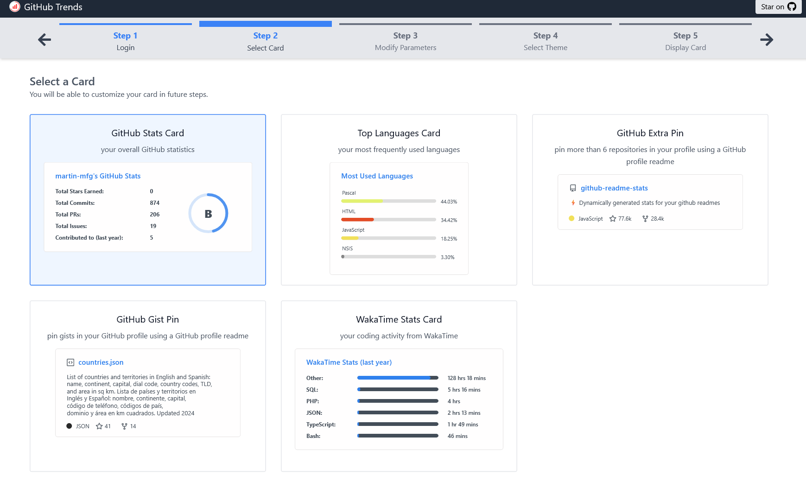

# Fork Information

This project is a fork of [github-readme-stats](https://github.com/anuraghazra/github-readme-stats).

## Key Differences

Compared to [github-readme-stats](https://github.com/anuraghazra/github-readme-stats), this project adds the following changes:

### Frontend for easy, visual configuration of cards

GitHub-Stats-Extended adds a frontend which allows users to visually configure stats cards. It is hosted at https://github-stats-extended.vercel.app/frontend.

The frontend is based on [GitHub Trends](https://github.com/avgupta456/github-trends) by [@avgupta456](https://github.com/avgupta456).

### Aggregate stats across organizations
To include stars from repos which are not owned by you, but where you are a collaborator or organization member, add `&role=OWNER,ORGANIZATION_MEMBER,COLLABORATOR` to your stats card url. To include such repos in your language stats, you can also add the same parameter to your top languages card url.

See [here](advanced_documentation.md#filtering-by-repository-and-owner) for full feature documentation.

The resolution of this most requested feature in github-readme-stats was [originally implemented](https://github.com/anuraghazra/github-readme-stats/issues/1#issuecomment-855681098) by [@developStorm](https://github.com/developStorm).

### Improved performance and latency

GitHub-Stats-Extended proactively precomputes and caches cards. This solves the problem where [cards wouldn't load on the first try](https://github.com/anuraghazra/github-readme-stats/issues/2603). It also gives GitHub-Stats-Extended more time while generating cards in the background, which allows it to fetch more repo data:

### Multi-page fetching for accurate star counts
GitHub-Stats-Extended fetches up to 1000 of your starred repositories to accurately compute your stars count. In github-readme-stats, this is limited to 100 repos because github-readme-stats doesn't have the above-mentioned performance improvements.

### Private contributions support
GitHub-Stats-Extended can include private contributions in your stats cards. You no longer have to deploy your own instance for that. Just log into the [GitHub-Stats-Extended Wizard](https://github-stats-extended.vercel.app/frontend) via the "GitHub Private Access" button (or click "Upgrade to Private Access" if already logged in). This will allow GitHub-Stats-Extended to see your private contributions.

### Display contributions to specific repositories or organizations

GitHub-Stats-Extended adds the ability to show contribution stats for specific repositories and organizations.

Especially for regular contributors in open source projects it might make sense to display an overview of their own contributions to these projects on their GitHub profile.

See [here](advanced_documentation.md#filtering-by-repository-and-owner) for full feature documentation.

----------

anuraghazra's contributions to github-readme-stats:

Add `&show=prs_authored,prs_commented,prs_reviewed,issues_authored,issues_commented` to your repo card url to display your contributions to the pinned repository.

----------

anurag's contributions to razorpay:

Add `&repo=userA/repoA,orgB/repoB` or `&owner=userC,orgD` to your profile stats url to filter your contributions by repo or organization. (The screenshot above uses further customization options.)

### Other
GitHub-Stats-Extended adds various other, minor improvements. For example, the repo card now supports the `card_width` parameter.

## Why This Fork Exists

[github-readme-stats](https://github.com/anuraghazra/github-readme-stats) is a great project, which unfortunately saw its development slow down in the past years, with [highly requested features](https://github.com/anuraghazra/github-readme-stats/issues/1935) getting delayed for a long time.

One of the valued maintainers [wrote](https://github.com/anuraghazra/github-readme-stats/pull/3911#issuecomment-3377726545):
> I joined the project as collaborator in the middle of 2023 and there was just a few guys in the team while hundreds of PRs, issues and discussions pending to be reviewed.
>
> The volume is overwhelming for the small team, especially taking into account that right now I'm alone online and working only sometimes when I have a free hours, so it took some time to get to your PR.

So I decided to implement some of the highly requested features and make the enhanced project available to everyone.

## Upstream Sync Strategy

The maintainers of [github-readme-stats](https://github.com/anuraghazra/github-readme-stats) keep their project up to date with dependency upgrades and do occasionally merge some pull requests. I regularly merge the latest upstream changes into this fork to keep it in sync with the upstream repo.

I also try to structure my own changes in a way that minimizes merge conflicts with the upstream repo. So some of my changes might even be merged back into [github-readme-stats](https://github.com/anuraghazra/github-readme-stats) if the upstream maintainers are interested.

## Compatibility Notes

GitHub-Stats-Extended aims to be fully compatible with [github-readme-stats](https://github.com/anuraghazra/github-readme-stats). Generally, additional functionality introduced in this fork has to be explictly enabled via some parameter.

So you can change an existing stats card url from [github-readme-stats](https://github.com/anuraghazra/github-readme-stats) to GitHub-Stats-Extended simply by changing the domain from `github-readme-stats.vercel.app` to `github-stats-extended.vercel.app`. The card will look the same.
